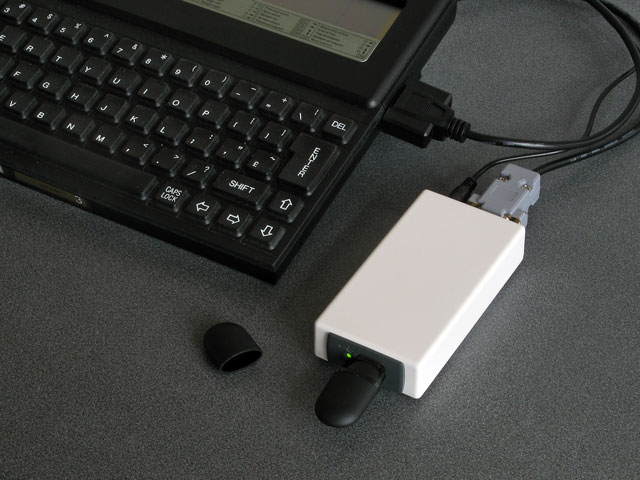
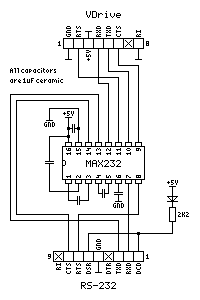
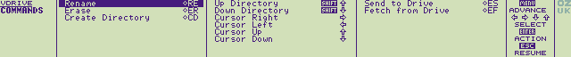

# VDriveZ88

A popdown application for the Cambridge Z88 to provide access to files on a USB drive via a Vinculum VDrive/VMusic module

## Introduction

FTDI offers a range of USB host modules such as the VDrive and VMusic which, when running Vinculum's firmware,
provide access to a USB flash drive over a serial (UART or SPI) connection.

Such a module can be connected to the Cambridge Z88's RS-232 serial port using a MAX232 interface circuit.

The VDriveZ88 popdown application can then be installed and run on the Z88 to provide a way to fetch the files
from the USB flash drive to the Z88, or to send files from the Z88 to the USB flash drive.

## Installation

Three sets of files are provided for different installation methods:

* The _RomCombiner_ directory contains `VDrive.63` which can be programmed to an EPROM cartridge using the [RomCombiner](https://cambridgez88.jira.com/wiki/spaces/ZRC/overview) BASIC program on the Z88.
* The _Installer_ directory contains `VDrive.app` and `VDrive.ap0` which can be installed in RAM ([natively in later versions of OZ](https://cambridgez88.jira.com/wiki/spaces/UG/pages/68780391/Appendix+J+-+Installing+applications+in+RAM) or by using the Installer [application](https://worldofspectrum.org/z88forever/rom-forever.html#installer) or [BASIC program](https://worldofspectrum.org/z88forever/basic-basinstaller.html) on older versions of OZ).
* The _Emulator_ directory contains `VDrive.epr` which is only really of interest if you have an emulator that emulates the serial port.

## Drive pinout

You will need to use a MAX232 or similar RS-232 driver to convert the voltage levels used by the VDrive to
the RS-232 standard used by the Z88.

There are also two sensible ways you could wire up the DE-9 connector:

1. Use the Z88 pinout and a straight-through DE-9 serial cable.
2. Use the PC pinout and a special cable that remaps to the Z88 pinout.

I prefer the second option as it will allow me to use the VDrive with other computers,
and once the adaptor cable has been made it can be used to connect other PC-standard serial devices to the Z88.

Both pinouts are listed in the table below along with an example pinout for the MAX232.

|VDrive|MAX232            |PC DE-9      |Z88 DE-9|
|------|------------------|-------------|--------|
|1 GND |15 GND            |5 GND        |7 GND   |
|2 RTS#|11 T1IN → 14 T1OUT|8 CTS        |5 CTS   |
|3 5V0 |16 VCC            |1 DCD, 6 DSR |8 DCD   |
|4 RXD |12 R1OUT ← 13 R1IN|3 TXD        |2 TXD   |
|5 TXD |10 T2IN → 7 T2OUT |2 RXD        |3 RXD   |
|6 CTS#| 9 R2OUT ← 8 R2IN |7 RTS        |4 RTS   |
|7 NC  |                  |             |        |
|8 RI# |15 GND            |5 GND        |7 GND   |

Note that the VDrive's `RI#` pin needs to be connected to ground and
the Z88 requires its `DCD` line to be driven high before it will receive any data.

The above circuit shows one possible way to wire up the VDrive and MAX232.
The pinout for the RS-232 port at the bottom is given for a PC DE-9 connector;
to use this with a Z88 you will need a cable wired with a "PC" end and "Z88" end,
swapping pin numbers according to the table above
(GND pin 5 on the PC end to GND pin 7 on the Z88 end,
CTS pin 8 on the PC end to CTS pin 5 on the Z88 end etc).

## Application overview

The application has been designed to work in a similar fashion to the Z88's native Filer.

  
*VDrive's directory listing window*

Once you have started the application and it has connected to the drive it will show a directory listing.

You can move around the directory listing with the cursor keys and interact with the file or folder that
is currently highlighted via the commands shown when you press the `MENU` key.

  
*List of commands shown when you press the `MENU` key*

Each command generally uses the same keyboard sequence as the equivalent command in the Z88's Filer,
though only a single file or directory is handled at a time so you do not need to mark the file with `ENTER` first.

Instead, the `ENTER` key will now prompt to fetch the file directly (`◇EF`) or go down into the directory (`SHIFT⇩`)
depending on whether the highlighted item is a file or directory.

  
*Pressing the `HELP` key will show information about the highlighted command*

Certain commands will cause a dialog box to appear with some more information about the file or directory
along with a prompt specific to the particular command you have selected (for example, if renaming a file it will
prompt you for the new file name, or if deleting a file it will ask for confirmation).

  
*Status dialog shown when fetching a file from the drive*

When being prompted for confirmation you can switch between yes/no by pressing `Y` or `N` or by pressing `◇J`
to toggle the option. `ENTER` will then confirm, or `ESC` will cancel.

## Filename compatibility

Filenames on the USB drive are limited to 8 characters with an optional extension of up to 3 characters.

Only uppercase letters, numbers, and the following symbols are valid in a filename on the USB drive:

`$` `%` `'` `-` `_` `@` `~` `` ` `` `!` `(` `)` `{` `}` `^` `#` `&`

When prompted for a filename it will be converted to uppercase automatically.

As the maximum length of these filenames is quite a bit shorter than the ones supported by the Z88
you will likely need to rename files when copying them from the Z88 to the USB drive.

Long filenames that already exist on the drive will usually take the form of `FILENA~1.TXT`.
The Z88 will accept the `~` in the filename but will ignore it and everything beyond it,
so if you copied that example file directly to the Z88 without renaming it it would appear as `FILENA`.

This need to correct filenames when transferring files to or from the Z88 and the USB flash drive
is why the application only handles a single file at a time.
If you want to transfer files in batches and preserve the filenames I would recommend using the ZipUp
application to group files into Zip archives.
